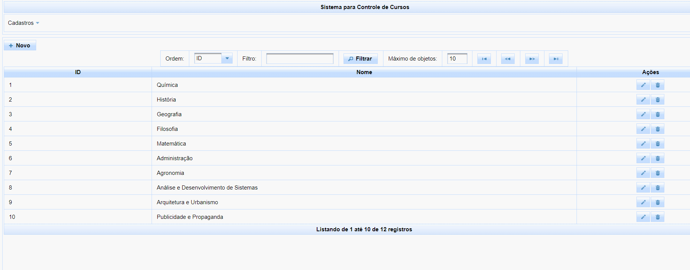

<h1 id="title" align="center">
  Sistema de Gerenciamento de Cursos
</h1>

<p align="center">
    
    
    
    
    
    
</p>

## 💻 Detalhes do projeto

O sistema foi desenvolvido durante um trabalho para a faculdade no ano de 2017. O projeto que tem por objetivo disponibilizar um sistema onde seja possível fazer o controle de cursos de uma universidade, cadastrando alunos, especialidades de professores, disciplinas e cursos. Feito com objetivo de aprimorar as habilidades de interpretação e resoluções de problemas conforme solicitado na elaboração do projeto. 
Os arquivos do frontend estão nesse repositório, [clique aqui para ver o backend](https://github.com/alexvieirasj/DAW-Modelo-1-Model.git)  

<h1 align="center">
    
</h1>

## :rocket: Tecnologias utilizadas no projeto

As tecnologias/ferramentas utilizadas no projeto foram:

- [Java 8](https://www.oracle.com/br/java/technologies/javase/javase8-archive-downloads.html)
- [PostgreSQL](https://jdbc.postgresql.org/changelogs/2017-08-01-42.1.4-release/)
- [Hibernate Validator](https://hibernate.org/orm/releases/4.2/)
- [Hibernate JPA](https://mvnrepository.com/artifact/org.hibernate.javax.persistence/hibernate-jpa-2.0-api)
- [Jasper Records](https://sourceforge.net/projects/jasperreports/)
- [All Themes](https://mvnrepository.com/artifact/org.primefaces.themes/all-themes/1.0.10)
- [Primefaces](https://www.primefaces.org/primefaces-6-1-final-released/)
- [JavaServer Faces](http://www.java2s.com/example/jar/j/download-javaxfaces2214jar-file.html)
- [Apache Tomcat 9](https://tomcat.apache.org/download-90.cgi)

## 👨🏻‍💻 Lista de ajustes e melhorias

O projeto ainda está em desenvolvimento e as próximas atualizações serão voltadas nas seguintes tarefas listadas abaixo:

- [ ] Melhorar o layout para diferenciar as manutenções basicas da principais
- [ ] Ajustar a diferença na inserção de usuários na manutenção (é aluno ou professor)
- [ ] Melhorar os filtros de buscas

## :package: Como utilizar o projeto

É preciso ter instalado no computador o [Git](https://git-scm.com) e o [Node.js](https://nodejs.org/) para clonar e executar o projeto. 
O projeto pode ser baixado com as linhas de comando ou no formato zip clicando no botão "Code" na opção "Download ZIP"

```bash

    # Clonar os repositórios
    $ git clone https://github.com/alexvieirasj/DAW-Modelo-1-Model.git
    $ git clone https://github.com/alexvieirasj/DAW-Modelo-1-Web.git

    # Criar o banco de dados local, mapeado no arquivo persistence.xml       
    $ jdbc:postgresql://localhost:5432/DAW-5N1-Modelo-1

    # Todas as bibliotecas + o projeto do model estão adicionados no projeto web

    # Abrir o projeto Web e executar via Netbeans, Intelij ou Eclipse
    
    # running on port 8091
```

## 🤝 Colaboradores

Lista de pessoas que contribuíram para este projeto:

<table>
  <tr>
    <td align="center">
      <a href="#">
        <br>
        <sub>
          <b>Alex Vieira</b>
        </sub>
      </a>
    </td>
  </tr>
</table>

## 😄 Seja um dos contribuidores<br>

Quer fazer parte desse projeto? Clique [AQUI](CONTRIBUTING.md) e leia como contribuir.

## 📝 Licença

Esse projeto está sob licença. Veja o arquivo [LICENÇA](LICENSE.md) para mais detalhes.

[⬆ Voltar ao topo](#title)
